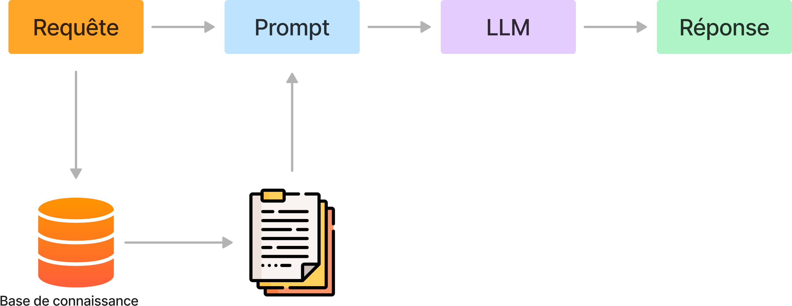

# Retrieval Augmented Generation (RAG) avec QGIS

## Définition

Le **Retrieval Augmented Generation (RAG)** est une technique qui permet d'utiliser un LLM avec ses propres données sans les coûts importants générés par l’entraînement ou l’affinage (fine-tuning) d’un modèle. 
Conceptuellement, la technique est relativement simple. Elle est faite de deux étapes qui sont:
* **Le Retrieval (récupération)**
  * Analyse la question de l’utilisateur et cherche (souvent à l’aide de la recherche sémantique) les documents qui contiennent la réponse.
  * Construit un prompt qui contient la question de l’utilisateur et les documents qui permettent d’y répondre (que l’on appelle souvent “le contexte”).
* **La Génération**
  * Demande au LLM de générer une réponse à la question en se basant uniquement sur les informations qui se trouvent dans les documents fournis dans le prompt. Insister pour que le modèle réponde “je ne sais pas” si la réponse ne se trouve pas dans les documents fournis dans le prompt.

## Architecture

## QGIS

Pour un assistant QGIS, la base de connaissances est constituée de la documentation QGIS, des tutoriels, des guides, des exemples de code, et des jeux de données.

Le RAG permet de rechercher précisément dans cette base de connaissances et de générer des réponses pertinentes aux questions posées par l'utilisateur.

L'accès au LLM pour la phase de génération permet également à l'assistant de proposer du code Python pour QGIS, des requêtes SQL, des expressions QGIS, et d'autres éléments de code nécessaires pour accomplir les tâches demandées.

