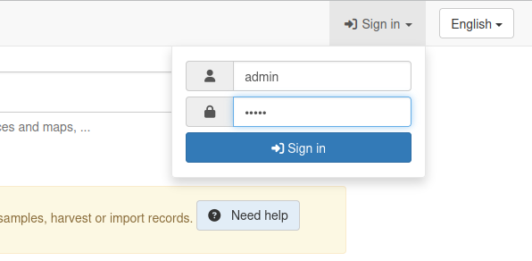
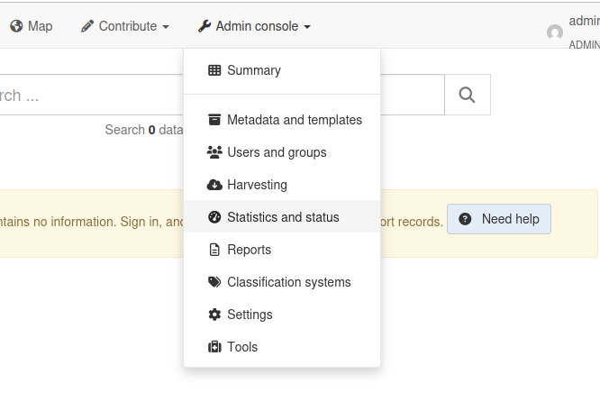
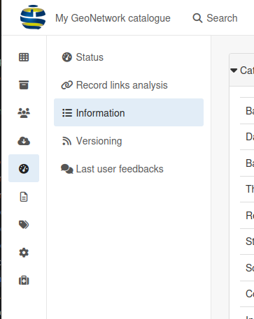
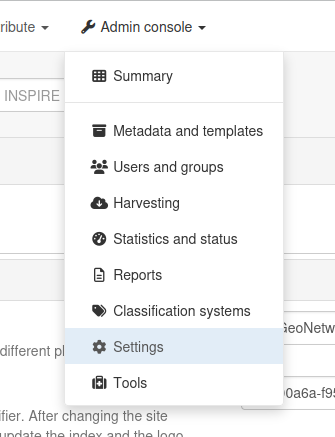
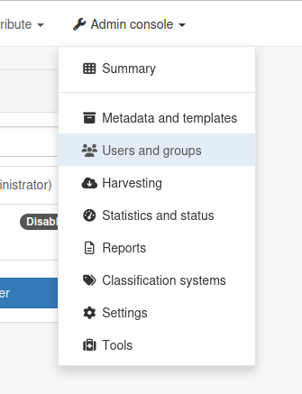
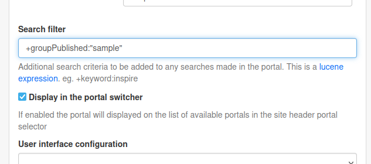
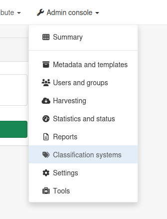
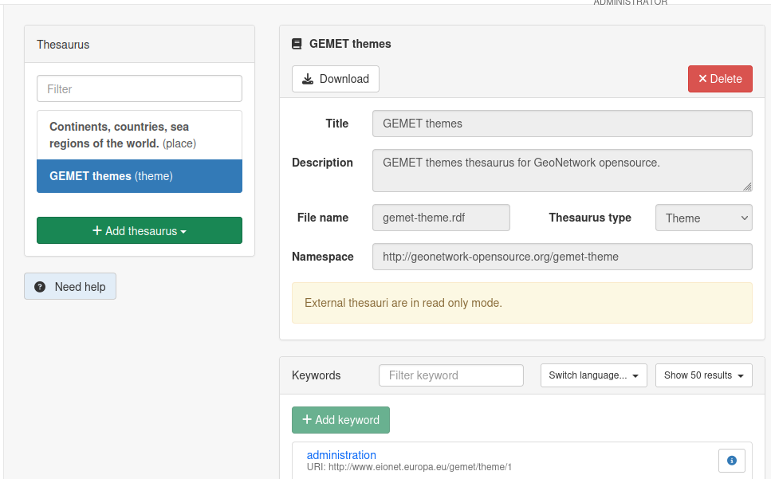

# Administration

Once a fresh GeoNetwork instance is deployed, it is usually a good idea to start with the administration module.

## Inspect the status of the instance

### 1. Log in as an Administrator

You should use the default `admin`/`admin` credentials.



### 2. Open the Administration dropdown and select "Statistics and status"



This will take you a page summarizing the status of the various components of GeoNetwork.

### 3. Open the "Information" tab



The Information page lists the various parameters used in this instance. This page is essential when troubleshooting issues such as database connection, file storage on disk, etc.

## Server Settings

### 4. Open the Administration dropdown and select "Settings"



This will take you to a list of settings letting you configure the way GeoNetwork works and behaves.

Settings can be used to, for instance:
* Changing the public host and port that will be used to access the instance from the web
* Configuring SMTP for mail notifications
* Enabling user feedbacks on catalog records
* Customize the authentication process (self-registration, CAPTCHA, password strength...)
* INSPIRE configuration
* Customizing the way user permissions are handled
* etc.

## Users & Groups Management

### 5. Open the Administration dropdown and select "Users and groups"



This is where you will be able to manage the users that will login to the instance and the groups they belong to.

Create a new group with the name you want. Please note that the "name" field will be used as an identifier later on, so write it down somewhere.

Next, create a new user and give it all available permissions in the newly created group, except the "administrator" status. Give it a login and password that you will remember later on.

## Portals

### 6. Go back to the "Settings" menu and open the "Sources" tab


This screen lets you, among other things, create "sub-portals". A sub-portal is a public interface to your catalog with its own configuration. This can for example be used to only show records of a certain type or published by a certain group.

### 7. Create a new sub-portal that will only show the records from the new group

Click on "Add portal". Give it a name and identifier, and then set the search filter to the following value:

```
+groupPublished:"mygroup"
```

::: info
Replace `mygroup` by the **identifier** of the group you created.
:::



This will make it so that this new sub-portal will only show records that are published by the group you created.

You can try visiting it from the top-left dropdown menu, although you will most likely still get an error because the catalog has yet to be populated with records.

## Keywords Management

### 8. Open the Administration dropdown and select "Classification systems"



GeoNetwork offers multiple systems for classification. This menu lets us access:
* Thesaurus management
* Category management

We will not be looking at categories in this workshop because their usage is not essential.

Thesauri, on the other hand, are extremely useful; a **thesaurus** is a controlled vocabulary containing keywords, sometimes called "concepts". Keywords are used to classify records and let users find what they want in a very quick and efficient way.

GeoNetwork handles two kinds of thesauri: **external** and **local**.

### 9. Import the GEMET thesaurus

GEMET stands for _GEneral Multilingual Environmental Thesaurus_. It is a widely used thesaurus and importing it into your GeoNetwork instance will allow it to recognise those keywords if they appear in your catalog, as well as let you use them in the metadata you create.

To import the GEMET thesaurus, click on "Add thesaurus" and then "from URL". Use the following URL to import the thesaurus: https://camptocamp.github.io/gs-workshop-geonetwork/gemet-theme.rdf

And click "Upload". You should see the GEMET Theme thesaurus showing up in the list, and you should be able to explore its content.



::: tip
As the name suggest, the keywords of this thesaurus _are_ translated into a few languages!
:::

### 10. Create a local thesaurus

A local thesaurus is meant to be modified and usually does not emanate from official bodies. We will now create one and add a keyword to it.

Click again on "Add thesaurus" and this time select "New thesaurus". Give it a name, description and file name.

You will quickly notice that this thesaurus offers more options such as modifying its name, description and of course adding keywords to it.


Try adding a few keywords that we will use later on.
