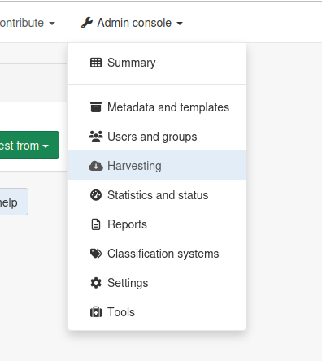
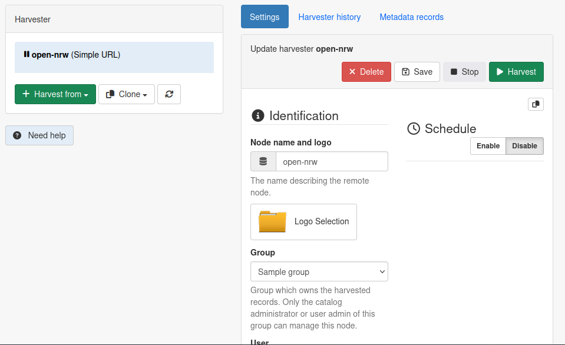
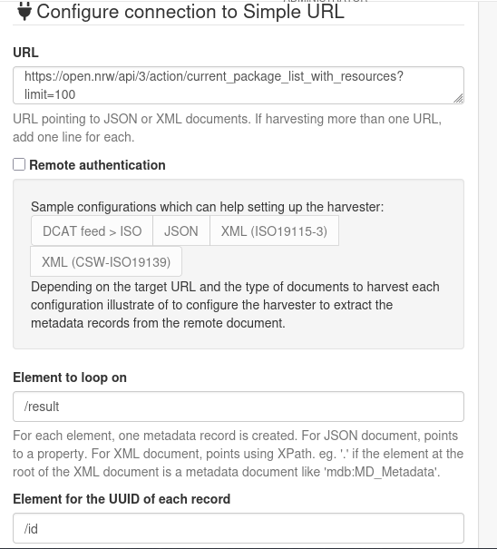
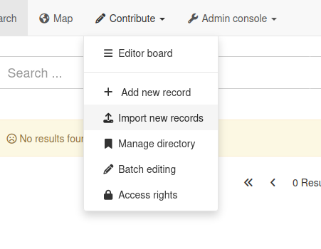
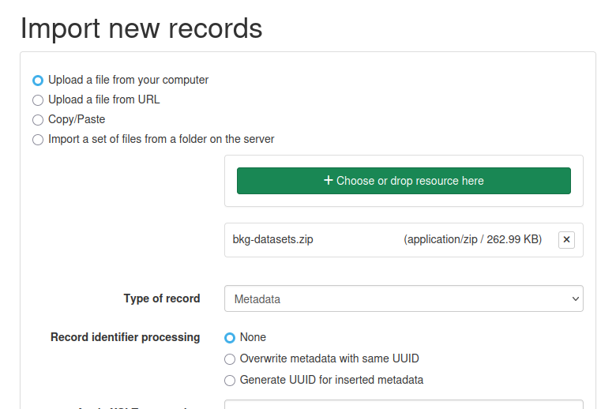
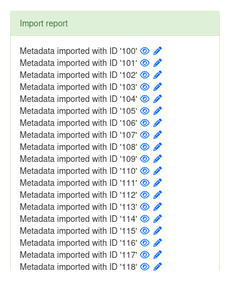

# Datensätze hinzufügen

In diesem Abschnitt werden wir unsere neue, frisch eingerichtete GeoNetwork-Instanz mit einigen Metadatensätzen befüllen.

## Harvesting

Der Prozess des „Harvesting“ bedeutet, dass Metadatensätze, die auf einer anderen Plattform veröffentlicht wurden, automatisch mithilfe standardisierter Protokolle kopiert werden. GeoNetwork unterstützt eine Vielzahl von Protokollen, die bekanntesten sind CSW und OAI-PMH. Das Harvesting kann so eingerichtet werden, dass es in festen Intervallen ausgeführt wird, Berichte erstellt und sogar E-Mail-Benachrichtigungen versendet – je nach Konfiguration von GeoNetwork.

In diesem Workshop möchten wir jedoch zeigen, dass GeoNetwork in der Lage ist, mit vielen anderen Plattformen und APIs zu interagieren, auch außerhalb der üblichen Protokolle im geospatialen Umfeld.

Aus diesem Grund werden wir jetzt eine Open-Data-Plattform harvesten: https://open.nrw/.

Diese Datenplattform läuft [unter der Haube mit CKAN](https://open.nrw/open-data/informationen-fuer-entwicklerinnen-und-entwickler), sodass wir deren API nutzen können, um Datensätze zu ernten.

### 1. Öffne das Dropdown-Menü „Administration“ und wähle „Harvesting“

### 2. Klicke auf „Harvest from“ und wähle „Simple URL“

Der Harvesting-Typ „Simple URL“ kann die meisten JSON-basierten APIs sowie einige XML-Formate verarbeiten. Seine Parameter können angepasst werden, um unterschiedliche Antwortformate zu verstehen.

### 3. Harvester einrichten & ausführen

Gib dem Harvester einen Namen und deaktiviere die Zeitplanung (damit er nicht unerwartet in der Zukunft läuft).

Verwende dann folgende Parameter für den Harvester:
* URL: https://open.nrw/api/3/action/current_package_list_with_resources?limit=20  
  Dies verweist auf die CKAN-API.
* Element zum Iterieren: `/result`
* Element für die UUID jedes Datensatzes: `/id`
* Paginierungsparameter: `deaktiviert`
* Anzuwendende XSL-Transformation: `schema:iso19115-3.2018:convert/fromJsonCkan`

Klicke anschließend auf „Speichern“. Der Harvester ist nun einsatzbereit. Du kannst jetzt auf „Harvest“ oben im Harvester-Panel klicken: 20 neue Datensätze sollten zu deinem lokalen Katalog hinzugefügt werden.

Du kannst sie sehen, indem du zur „Suche“-Seite der GeoNetwork-Oberfläche navigierst und auf einen der Einträge klickst, um weitere Informationen zu erhalten.

## Importieren (optional)

GeoNetwork ermöglicht das Exportieren und Importieren mehrerer Datensätze in einer ZIP-Datei, die die Metadaten sowie alle zugehörigen Dateien enthält. Dieses Exportformat nennt sich „MEF“ (Metadata Export Format) und ist praktisch, da es mit verschiedenen Versionen von GeoNetwork kompatibel ist.

Für diesen Workshop wurde ein kleiner Export des [BKG Geodaten-Katalogs](https://gdk.gdi-de.org/gdi-de) vorbereitet.

### 4. Lade die ZIP-Datei mit den Datensätzen herunter

Die ZIP-Datei ist hier gespeichert: [bkg-datasets.zip](/bkg-datasets.zip)

### 5. Öffne das Dropdown-Menü „Beitragen“ und wähle „Neue Datensätze importieren“

Dies führt dich zu einer Seite mit mehreren Optionen zum Importieren von Datensätzen: per URL, durch das Einfügen von XML oder durch das Hochladen einer ZIP-Datei.

### 6. Datei auswählen und importieren

Wähle die Option „Datei von deinem Computer hochladen“ und klicke auf den grünen Button, um die gerade heruntergeladene Datei auszuwählen.

Lasse die anderen Optionen unverändert und klicke unten auf der Seite auf „Importieren“.

Nach kurzer Zeit sollte eine Nachricht erscheinen, die bestätigt, dass 20 Datensätze erfolgreich importiert wurden. Falls du neugierig bist, navigiere zur Suchoberfläche, um sie dir anzusehen!

