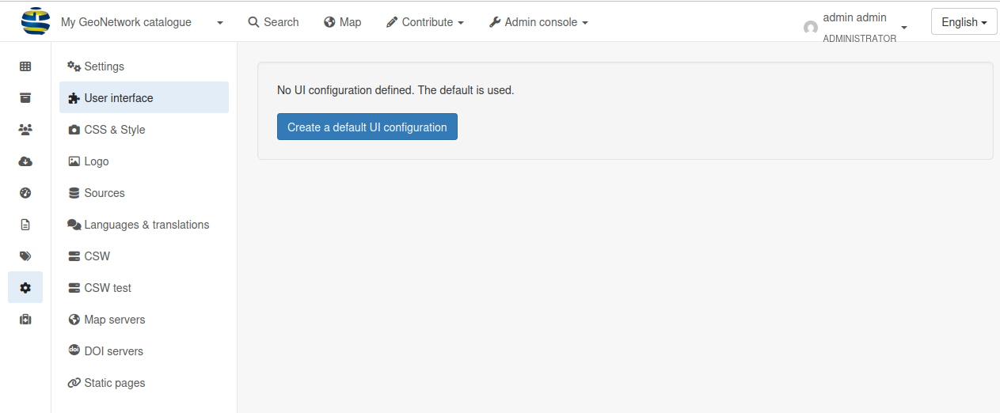

# Häufige Probleme

## Ich erhalte die Fehlermeldung "Index kann nicht gefunden werden"

Es muss ein Problem mit der Art und Weise geben, wie GeoNetwork eingerichtet wurde, insbesondere mit dem Host und Port, die für die Verbindung zu ElasticSearch angegeben wurden. Stellen Sie sicher, dass der richtige ElasticSearch-Host und -Port beim Start von GeoNetwork angegeben wurden und dass ElasticSearch tatsächlich ohne Fehler ausgeführt wird.

## GeoNetwork startet nicht

Es gibt mehrere mögliche Gründe dafür:
* Datenbankverbindung fehlgeschlagen
* Falsche Java-Version
* Beschädigte Datenbank, bei der ein Migrationsjob fehlschlägt

## Jedes Mal, wenn ich die Suchoberfläche öffne, erscheint eine Fehlermeldung

Sie können versuchen, die Datensätze im Menü Administration/Tools neu zu indexieren. Wenn es nicht funktioniert, versuchen Sie, den Index zu löschen und neu zu erstellen (2. Option).

## Ich erhalte immer noch einen Fehler, nachdem ich Datensätze hinzugefügt habe

Versuchen Sie, ein neues Set von Benutzeroberflächeneinstellungen im Menü Administration/Settings zu erstellen:



Denken Sie daran, die Einstellungen nach der Erstellung zu speichern.

## Etwas funktioniert nicht mit meinen Docker-Containern

Mit dem folgenden Befehl können Sie die Logs anzeigen, um zu sehen, was innerhalb der Docker-Composition vor sich geht:

```shell
docker compose logs -f
```

Die Ausgabe der Logs im Terminal zu beenden, drücken Sie STRG+C.
