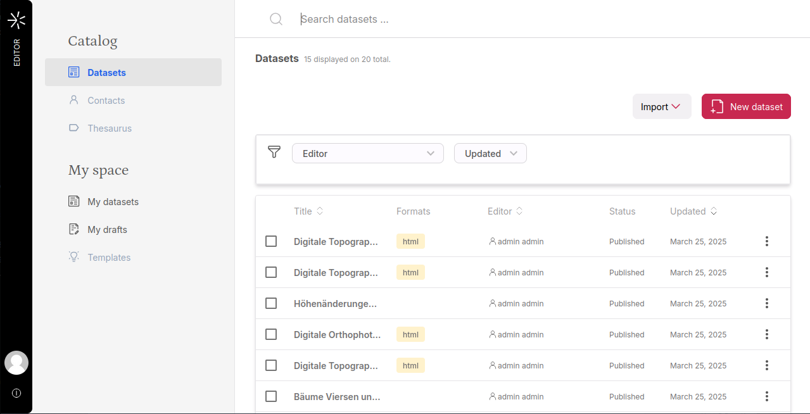
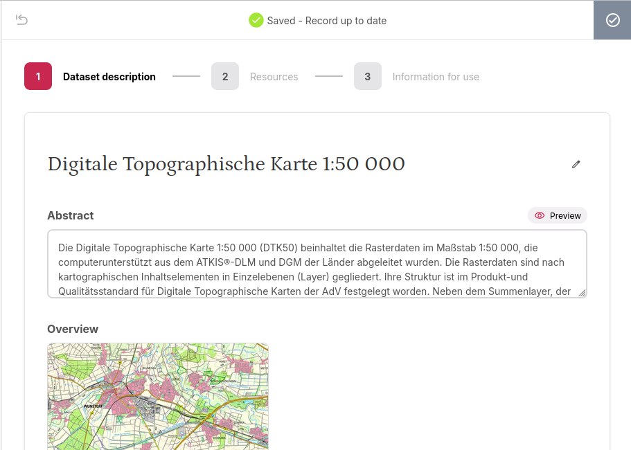
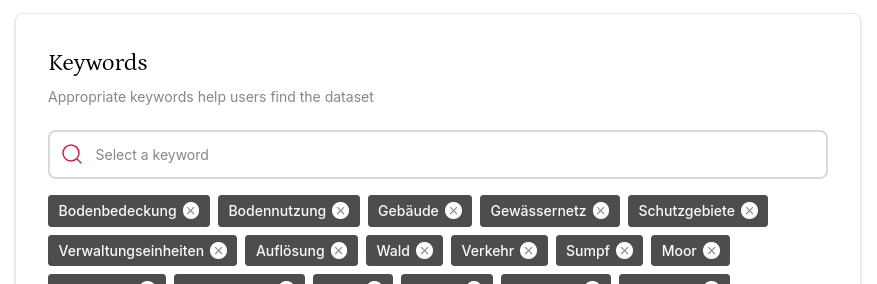
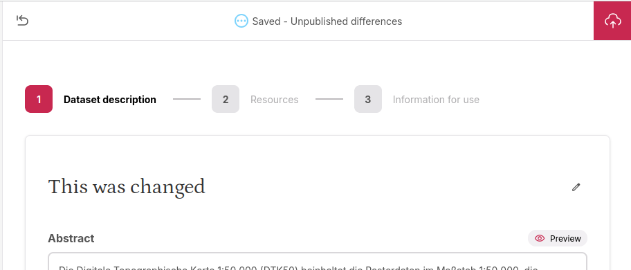
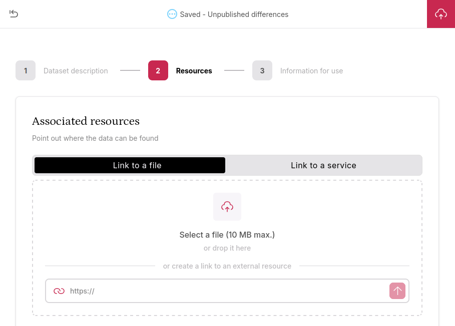
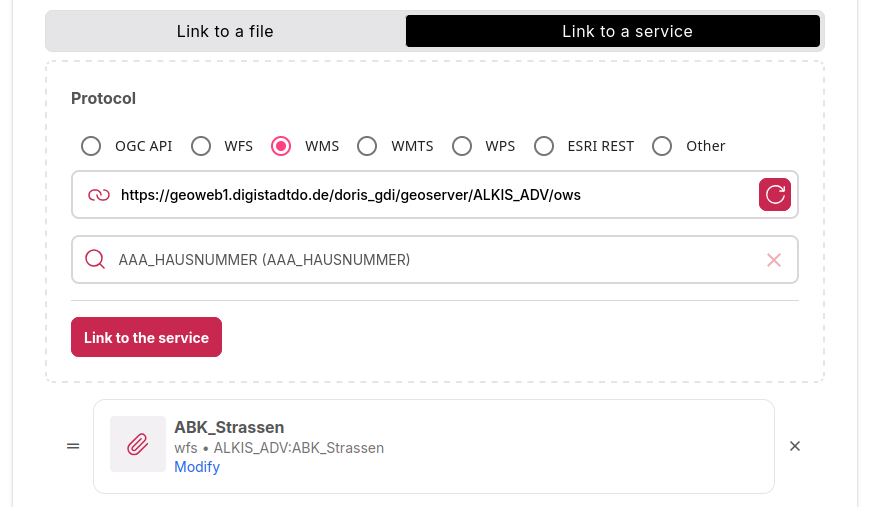
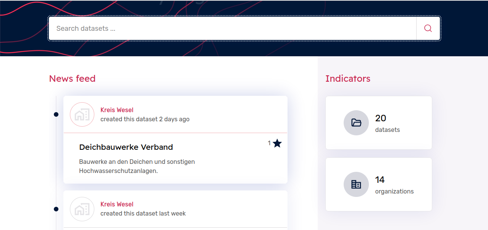
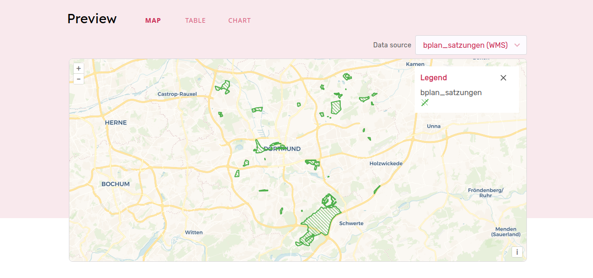
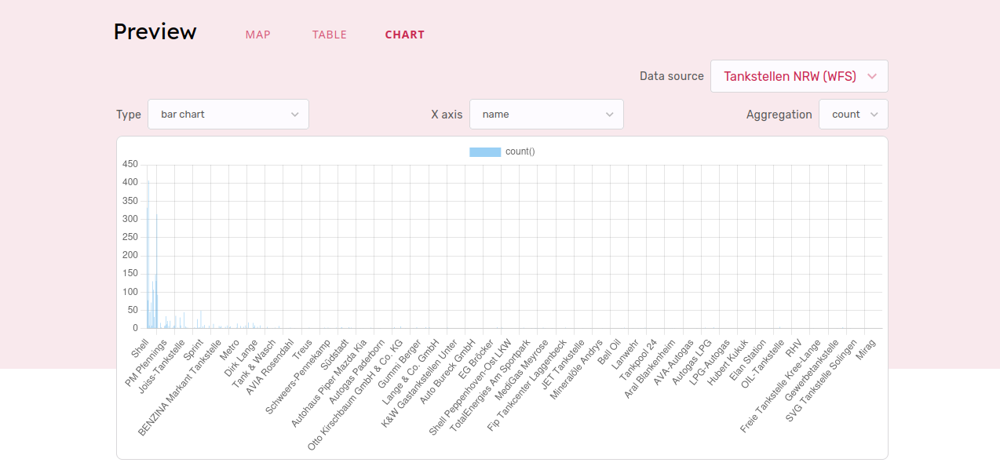

# Deploying the Metadata Editor

As for the Datahub, we will now add a section to the `docker-compose.yml` file to be able to try out the Metadata Editor application from GeoNetwork-UI.

### 1. Open the `docker-compose.yml` file and add the Metadata Editor image

Add the following lines to the `docker-compose.yml` file we created earlier:

```yaml
  metadata-editor:
    image: geonetwork/geonetwork-ui-metadata-editor:2.4.4
    depends_on:
      geonetwork:
        condition: service_healthy
    volumes:
      - ./configuration/:/usr/share/nginx/html/metadata-editor/assets/configuration
    labels:
      - "traefik.enable=true"
      - "traefik.http.routers.metadataeditor.rule=Host(`localhost`) && PathPrefix(`/metadata-editor`)"
      - "traefik.http.routers.metadataeditor.entrypoints=web"
```

### 2. Start the Metadata Editor container

**Stop any running command with CTRL+C.**

Run the following command on a terminal inside the workshop folder:

```shell
docker compose up -d
```

The Metadata Editor application should be accessible on http://localhost:8080/metadata-editor/



### 3. Create a new record

Click on "New dataset". this will take you to an empty form. Take some time to review the available fields and fill out the ones you want.



Note that the keywords we have created earlier should be available in the "Dataset description" section.



Notice also how you can refresh the page without losing your work.

Once ready, **click on "Publish" (cloud icon) on the top-right.**

You can always revert your pending changes instead of publishing by clicking on the "Revert" icon on the top-left corner.



### 4. Attach a data file to the record

In the same record, go to the "Resources" tab.

Download the file here: <a target="_blank" href="/gs-workshop-geonetwork/fahrradabstellanlagen.geojson">fahrradabstellanlagen.geojson</a>

Look at the "Associated resources" block, and select "Link to a file".



Attach it to the record by dropping it on the "Select a file" area.

### 5. Add links to web services

Now, switch to "Link to a service". Try linking those two services:

* URL: https://geoweb1.digistadtdo.de/doris_gdi/geoserver/ALKIS_ADV/ows  
  Protocol: WMS
* URL: https://geo.kreis-viersen.de/ows/osm-daten  
  Protocol: WFS

Select one of the layers from each of these services. Feel free to try other services! There are many protocols supported.



### 6. Publish the record

The Publish button is at the top right.

### 7. Open the record in the Datahub

Go to http://localhost:8080/datahub/news.

You should find the modified record at the top of the Datahub Newsfeed.



Open the record: the data should now be showing the map, table and chart previews!




