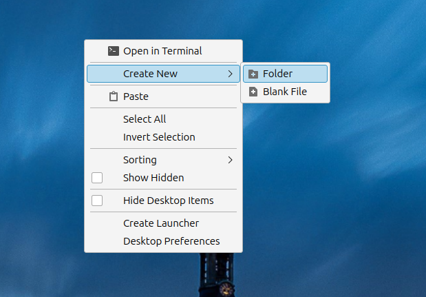
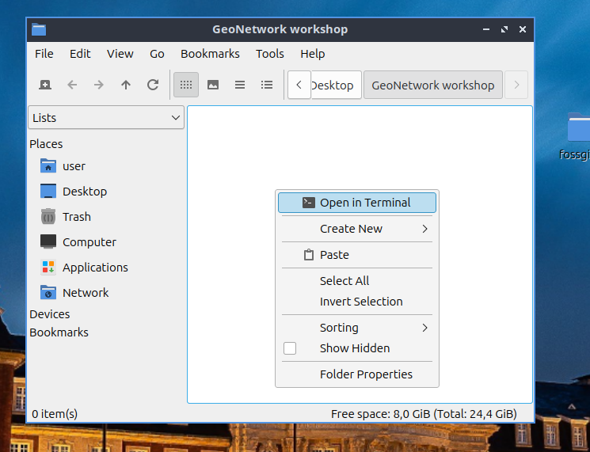
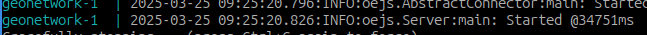
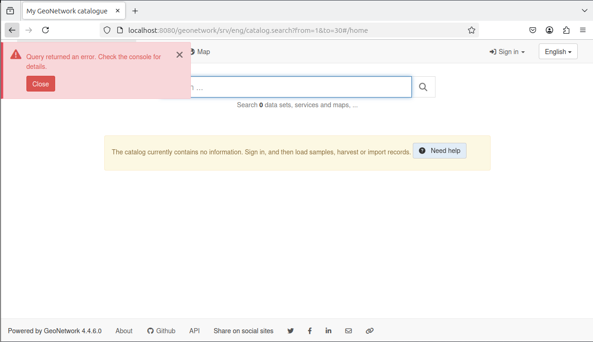

# Deploying

GeoNetwork is a Java web application. It is distributed as a WAR file, which can be deployed in a Java servlet container (e.g. Apache Tomcat or Jetty).

This section will describe two ways to deploy GeoNetwork: using **docker** and **docker-compose**, and using a **local installation**.

## Using Docker and Docker-Compose

Each version of GeoNetwork is also distributed as a docker image with a slight delay. Docker images can be found on DockerHub at
https://hub.docker.com/_/geonetwork.

The corresponding Dockerfiles are found in https://github.com/geonetwork/docker-geonetwork. This repository also contains docker-compose files to easily deploy GeoNetwork with a PostgreSQL database and an ElasticSearch cluster.

### 1. Create a dedicated folder

Right-click on the desktop background and create a folder named "GeoNetwork Workshop".



### 2. Create a `docker-compose.yml` file in that folder

Download or copy the contents the [docker-compose.yml](/docker-compose.yml) file provided for this workshop and put it in the newly created folder.

### 3. Start the `geonetwork` service

Open th "GeoNetwork Workshop" folder and right-click on it to open a terminal:



This terminal will be used throughout the workshop. Now, run the following commands:

```shell
docker compose up -d
docker compose logs -f geonetwork
```

After a while you should see the following line in the GeoNetwork output log:



Congratulations! GeoNetwork is now running on your computer. Open http://localhost:8080/geonetwork/ to confirm that the instance is responding to web requests.



Don't worry about the error; the database is completely empty so the search requests will not succeed. This will disappear once we add some records in it.

## Using the WAR package (optional)

This method requires the following to be installed on your computer:
* Java 11 or above (OpenJDK is recommended)
* Apache Tomcat or Jetty (version 9 recommended)

For this method we will not configure a PostgreSQL database. Instead, we will let GeoNetwork create its own local **h2** database; please note that this type of database is not suitable for production!

### 1. Download the WAR file

Open a terminal in your home folder and run the following command:

```shell
wget https://downloads.sourceforge.net/project/geonetwork/GeoNetwork_opensource/v4.4.6/geonetwork.war
```

### 2. Copy the WAR file to the Java web server

Run the following command in your terminal:

```shell
cp geonetwork.war /usr/share/apache-tomcat{X}/webapps/.
```

::: info
Note that the path to where the WAR file needs to be copied depends on the servlet container you use. The example above is for a default setup of Apache Tomcat.
:::

### 3. Start the Java web server

If started, Tomcat/Jetty will automatically deploy the application. If not, start the Java web server to deploy. Please refer to the documentation of the servlet container you're using for this step.

Open http://localhost:8080/geonetwork/ to confirm that the instance is responding to web requests.
